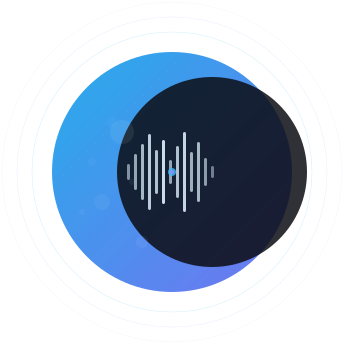

<p align="center">
  
  &nbsp;&nbsp;&nbsp;&nbsp;&nbsp;&nbsp;&nbsp;&nbsp;
  
</p>

<p align="center">
  <strong>Multi-tenant telephony intelligence platform</strong><br>
  Real-time call analysis with configurable LLM-powered insight detection.
</p>

---

Callisto listens to live phone calls via Twilio Media Streams, transcribes audio in real time with Deepgram or Whisper, and evaluates configurable insight templates against the conversation using any OpenAI-compatible LLM. Detected insights are delivered to agent dashboards over WebSocket as the call happens, with deep post-call analysis, summaries, and trend analytics.

## Architecture

```
Twilio Call ──► Ingestion Server (WebSocket, port 5310)
                  │
                  ├─► Deepgram Streaming / Whisper ──► Redis Streams
                  │                                        │
                  │                                   Evaluator (Redis consumer)
                  │                                        │
                  │                                   LLM evaluation (sliding window)
                  │                                        │
                  │                                   Redis Pub/Sub ──► Broadcaster (WS, port 5311)
                  │                                        │                    │
                  │                                   Postgres              React Frontend
                  │
                  └─► WAV file ──► Celery cold-path chain
                                      ├─► Deep analysis (full-transcript LLM pass)
                                      ├─► Summary generation (sentiment, topics, action items)
                                      └─► Cost accounting
```

**Services:**

| Service | Port | Description |
|---------|------|-------------|
| `api` | 5309 | Flask REST API + Twilio webhooks + Google OAuth |
| `ingestion` | 5310 | WebSocket server for Twilio Media Streams |
| `evaluator` | — | Redis Streams consumer, sliding window LLM evaluation |
| `broadcaster` | 5311 | WebSocket server for real-time insight delivery |
| `worker` | — | Celery worker for cold-path analysis |
| `frontend` | 5308 | React + Vite dashboard |
| `postgres` | 5433 | PostgreSQL 16 |
| `redis` | 6380 | Redis 7 (Celery broker + Redis Streams + Pub/Sub) |

## Quick Start

### Prerequisites

- Docker and Docker Compose
- A Twilio account with a phone number
- A Deepgram account (free tier: $200 credit) or local Whisper
- An OpenAI-compatible LLM endpoint (OpenAI, Ollama, etc.)
- A Google Cloud project with OAuth credentials

### 1. Configure environment

```bash
cp .env.example .env
# Edit .env with your API keys and credentials
```

Generate a JWT secret:

```bash
python3 -c "import secrets; print(secrets.token_urlsafe(32))"
```

### 2. Start all services

```bash
docker compose up --build
```

This starts all 8 services. The API runs migrations automatically on startup.

### 3. Set up Google OAuth

1. Go to [Google Cloud Console](https://console.cloud.google.com) → APIs & Services → Credentials
2. Create an OAuth 2.0 Client ID (Web application)
3. Add your redirect URI: `https://your-domain.com/auth/google/callback`
4. Enable the **People API** (for Google Contacts sync)
5. Add your email as a test user in the OAuth consent screen

### 4. Configure Twilio

Set your Twilio phone number's voice webhook to:

```
POST https://your-domain.com/webhooks/twilio/voice
```

### 5. Configure nginx (or your choice of reverse proxy)

Callisto needs a reverse proxy to route traffic to the correct services.
The following is an example of an nginx configuration:

```nginx
server {
    listen 443 ssl;
    server_name callisto.yourdomain.com;

    ssl_certificate     /etc/letsencrypt/live/callisto.yourdomain.com/fullchain.pem;
    ssl_certificate_key /etc/letsencrypt/live/callisto.yourdomain.com/privkey.pem;

    # Flask API + Auth + Webhooks
    location /api/ {
        proxy_pass http://127.0.0.1:5309;
        proxy_set_header Host $host;
        proxy_set_header X-Forwarded-For $proxy_add_x_forwarded_for;
        proxy_set_header X-Forwarded-Proto $scheme;
    }
    location /auth/google/ {
        proxy_pass http://127.0.0.1:5309;
        proxy_set_header Host $host;
        proxy_set_header X-Forwarded-For $proxy_add_x_forwarded_for;
        proxy_set_header X-Forwarded-Proto $scheme;
    }
    location /auth/me {
        proxy_pass http://127.0.0.1:5309;
        proxy_set_header Host $host;
        proxy_set_header X-Forwarded-For $proxy_add_x_forwarded_for;
        proxy_set_header X-Forwarded-Proto $scheme;
    }
    location /webhooks/ {
        proxy_pass http://127.0.0.1:5309;
        proxy_set_header Host $host;
        proxy_set_header X-Forwarded-For $proxy_add_x_forwarded_for;
        proxy_set_header X-Forwarded-Proto $scheme;
    }
    location /health {
        proxy_pass http://127.0.0.1:5309;
    }

    # Twilio Media Streams WebSocket
    location /ws/twilio/ {
        proxy_pass http://127.0.0.1:5310;
        proxy_http_version 1.1;
        proxy_set_header Upgrade $http_upgrade;
        proxy_set_header Connection "upgrade";
        proxy_set_header Host $host;
        proxy_read_timeout 86400;
    }

    # Broadcaster WebSocket
    location /ws/calls/ {
        proxy_pass http://127.0.0.1:5311;
        proxy_http_version 1.1;
        proxy_set_header Upgrade $http_upgrade;
        proxy_set_header Connection "upgrade";
        proxy_set_header Host $host;
        proxy_read_timeout 86400;
    }

    # Frontend (everything else)
    location / {
        proxy_pass http://127.0.0.1:5308;
        proxy_set_header Host $host;
        proxy_set_header X-Forwarded-For $proxy_add_x_forwarded_for;
        proxy_set_header X-Forwarded-Proto $scheme;
        proxy_http_version 1.1;
        proxy_set_header Upgrade $http_upgrade;
        proxy_set_header Connection "upgrade";
    }
}
```

### 6. Create a tenant

Log in via Google OAuth at `https://your-domain.com`. If your email is in `SUPERADMIN_EMAILS`, you'll have admin access. Go to Administration → create a tenant with your Twilio number, then assign your user to it.

### 7. Add insight templates

Go to Templates and create templates that define what to detect in calls:

| Name | Category | Severity | Prompt |
|------|----------|----------|--------|
| Churn Intent | sales | critical | Detect if the caller expresses intent to cancel, leave, or switch providers. |
| Frustration | support | warning | Detect if the caller expresses frustration, anger, or complaints. |
| Upsell Opportunity | sales | info | Detect if the caller asks about upgrades or additional features. |

### 8. Make a call

Call your Twilio number. The call stays open (no forwarding needed for testing). Speak for 15-30 seconds and watch insights appear in real time on the dashboard.

## Environment Variables

See [`.env.example`](.env.example) for the complete list with descriptions.

| Variable | Required | Description |
|----------|----------|-------------|
| `LLM_API_KEY` | Yes | API key for your LLM provider |
| `LLM_BASE_URL` | Yes | OpenAI-compatible endpoint URL |
| `LLM_MODEL` | Yes | Model name (e.g. `gpt-4o-mini`, `llama3.2`) |
| `DEEPGRAM_API_KEY` | No | Enables Deepgram streaming STT |
| `STT_PROVIDER` | No | `auto`, `deepgram`, or `whisper` |
| `TWILIO_ACCOUNT_SID` | Yes | Twilio account SID |
| `TWILIO_AUTH_TOKEN` | Yes | Twilio auth token |
| `INGESTION_WS_HOST` | Yes | Public hostname for WebSocket (used in TwiML) |
| `GOOGLE_CLIENT_ID` | Yes | Google OAuth client ID |
| `GOOGLE_CLIENT_SECRET` | Yes | Google OAuth client secret |
| `GOOGLE_REDIRECT_URI` | Yes | OAuth callback URL |
| `JWT_SECRET` | Yes | Secret for signing JWTs |
| `SUPERADMIN_EMAILS` | No | Comma-separated emails that get admin on first login |
| `FRONTEND_URL` | Yes | Frontend URL for OAuth redirects |

## Project Structure

```
callisto/
├── src/callisto/              # Python backend
│   ├── app.py                 # Flask app factory
│   ├── config.py              # Configuration from env vars
│   ├── models/                # SQLAlchemy models (Tenant, Call, Contact, Insight, etc.)
│   ├── api/                   # REST API endpoints
│   ├── auth/                  # Google OAuth + JWT middleware
│   ├── ingestion/             # Twilio WebSocket server + audio decoding
│   ├── transcription/         # Deepgram streaming + Whisper
│   ├── evaluation/            # Sliding window insight evaluator
│   ├── broadcaster/           # WebSocket insight broadcaster
│   └── tasks.py               # Celery cold-path pipeline
├── frontend/                  # React + Vite + TypeScript
├── alembic/                   # Database migrations
├── docker-compose.yml
├── Dockerfile
└── .env.example
```

## License

Copyright © 2026 Vaughan.Codes (Daniel Vaughan). All rights reserved.

See [LICENSE](LICENSE) for details.
